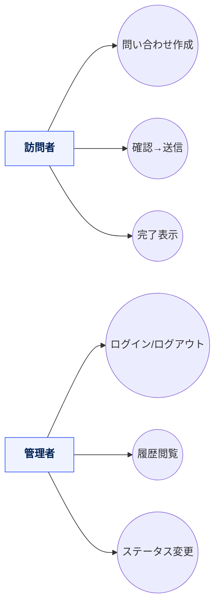
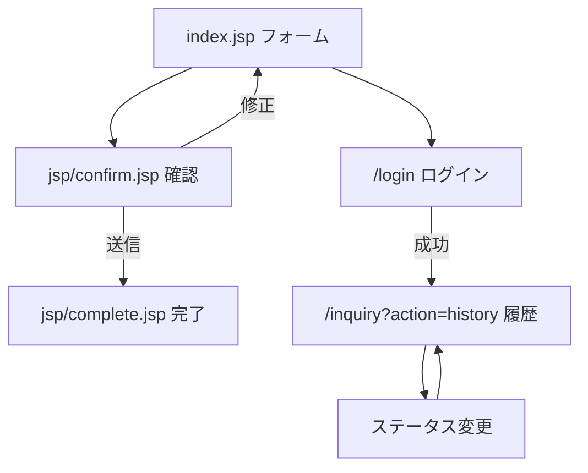
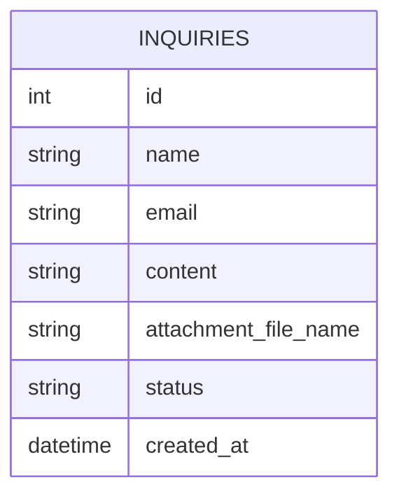
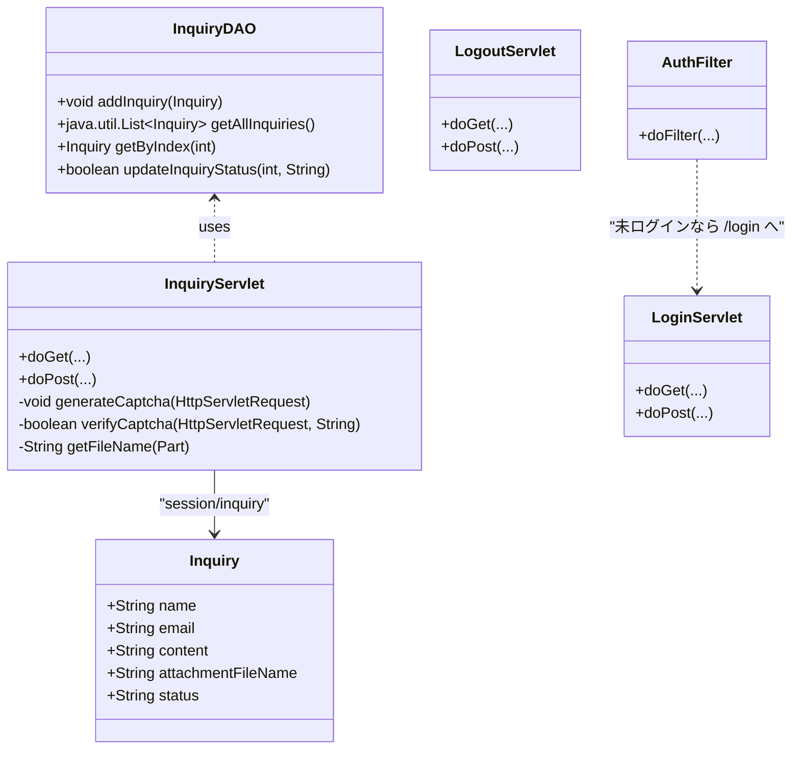

# InquiryApp（前期版）— 問い合わせ管理ミニシステム

**問い合わせ送信（フォーム）**、**確認→完了フロー**、**ファイル添付（アップロード）**、**簡易CAPTCHA**、**問い合わせ履歴の閲覧・ステータス変更（ログイン保護）**を行う学習用 Web アプリです。  
Jakarta Servlet (Servlet 6) + JSP + JSTL を前提とした **Eclipse Dynamic Web Project** 構成。DAO は **メモリ常駐（インメモリ）** 実装です。

> **注**: 本 README は同梱ソース（`InquiryApp-zennki-master`）に基づくテンプレートです。クラス名やパスが異なる場合は読み替えてください。

---

## 目次
- [機能](#機能)
- [アーキテクチャ](#アーキテクチャ)
- [ディレクトリ構成](#ディレクトリ構成)
- [セットアップと起動](#セットアップと起動)
- [サンプル操作](#サンプル操作)
- [ユーザーストーリー](#ユーザーストーリー)
- [ユースケース図（Mermaid）](#ユースケース図mermaid)
- [画面遷移図（Mermaid）](#画面遷移図mermaid)
- [ER 図（Mermaid）](#er-図mermaid)
- [クラス図（Mermaid）](#クラス図mermaid)
- [クラス設計表（責務・主要メソッド）](#クラス設計表責務主要メソッド)
- [用語辞書](#用語辞書)
- [ライセンス](#ライセンス)

---

## 機能

**訪問者（未ログイン）**
- 問い合わせの作成（氏名・メール・本文・ファイル添付）
- CAPTCHA による簡易ボット対策
- 送信前の確認画面 → 完了画面

**管理者（ログイン）**
- 問い合わせ履歴の閲覧
- ステータス変更（例: 新規／対応中／完了）  
  ※ `/jsp/*` 配下はフィルタでログイン必須

---

## アーキテクチャ

- **言語／ランタイム**: Java 17+ / Jakarta Servlet 6
- **Web**: JSP + JSTL（`core` タグ）
- **永続化**: **インメモリ DAO**（`InquiryDAO` が `List<Inquiry>` を同期リストで保持）
- **ファイルアップロード**: `@MultipartConfig`（アップロード先は `webapp/uploads`）
- **セキュリティ**: `AuthFilter` による `/jsp/*` へのアクセス制御、ログインは固定デモユーザ
- **構成**: Entity / DAO / Servlet / Filter / JSP / CSS

---

## ディレクトリ構成

> Eclipse Dynamic Web Project（`src/main` 配下）

```text
src/
└─ main
   ├─ java/
   │  └─ com/example/inquiry/
   │     ├─ Inquiry.java
   │     ├─ InquiryDAO.java
   │     ├─ InquiryServlet.java
   │     └─ auth/
   │        ├─ AuthFilter.java
   │        ├─ LoginServlet.java
   │        └─ LogoutServlet.java
   └─ webContent/
      ├─ WEB-INF/
      │  └─ web.xml
      ├─ index.jsp              # フォーム（トップ）
      ├─ jsp/
      │  ├─ login.jsp           # ログイン画面
      │  ├─ confirm.jsp         # 確認画面
      │  ├─ complete.jsp        # 完了画面
      │  └─ inquiry_history.jsp # 履歴（ログイン必須）
      ├─ style.css
      └─ uploads/               # 添付ファイル保存（Servlet が自動作成）
```

## セットアップと起動
1) 事前準備
 - Java 17 以上
 - Tomcat 10.1+（Jakarta 名前空間）
 - JSTL（jakarta.servlet.jsp.jstl-api）をランタイムに配置済みであること（最新 Tomcat + 依存解決済みテンプレならそのまま動作）
2) インポートと実行
 - Eclipse で Dynamic Web Project としてインポート
 - サーバーに Tomcat 10.1+ を追加 → プロジェクトをアタッチ
 - http://localhost:8080/ にアクセス（コンテキストルートは環境により異なる）

### アップロード先: 初回アクセス時に webapp/uploads が作成されます。権限で失敗する場合は書き込み可にしてください。

## サンプル操作
 - 問い合わせ送信: index.jsp から氏名・メール・本文・ファイルを入力 → CAPTCHA を解いて送信
→ 確認画面で内容を確認 → 完了で DAO に保存されます。
 - 履歴・ステータス変更（管理者）: /login でログイン → 問い合わせ履歴（/inquiry?action=history）から変更
 -- ログイン用の固定デモ資格情報は LoginServlet 内の定数を参照してください（メール・パスワードはコード定義）。

## ユーザーストーリー
 - 訪問者として、シンプルなフォームで問い合わせを送り、確認してから送信し、完了を把握したい。
 - 管理者として、新着問い合わせを一覧で把握し、ステータスを更新したい。

## ユースケース図


## 画面遷移図


## ER 図


## クラス図


## クラス設計表（責務・主要メソッド）
| クラス              | 役割（責務）                             | 主要メソッド                                                 | 共同作業相手                         |
| ---------------- | ---------------------------------- | ------------------------------------------------------ | ------------------------------ |
| `Inquiry`        | 問い合わせドメイン                          | getter/setter                                          | `InquiryDAO`, `InquiryServlet` |
| `InquiryDAO`     | 問い合わせの保持（インメモリ）                    | `addInquiry`, `getAllInquiries`, `updateInquiryStatus` | `InquiryServlet`               |
| `InquiryServlet` | フォーム→確認→完了・履歴・ステータス変更・CAPTCHA・添付保存 | `doGet`, `doPost`                                      | `InquiryDAO`                   |
| `LoginServlet`   | ログイン                               | `doGet`, `doPost`                                      | `AuthFilter`                   |
| `LogoutServlet`  | ログアウト                              | `doGet`, `doPost`                                      | すべて                            |
| `AuthFilter`     | `/jsp/*` の認可                       | `doFilter`                                             | すべて                            |

## 用語辞書
| 用語        | 意味                                    |
| --------- | ------------------------------------- |
| CAPTCHA   | 簡易的な足し算で人間確認（`InquiryServlet` が生成/検証） |
| インメモリ DAO | 起動中のみ保持される揮発データ（サーバ再起動で消える）           |
| ステータス     | 問い合わせの状態（初期値は `新規`。画面で更新可能）           |
| 添付ファイル    | `uploads` ディレクトリに保存されるアップロードファイル      |

## ライセンス
 - 教育目的のサンプル。必要に応じてプロジェクト方針に合わせて追記してください。
```text

**補足**  
- Mermaid のコードブロックは **小文字 `mermaid`** を使用しています。  
- Mermaid 内では **行内コメント（`--`）を使わない**でください。コメントは `%%` で行頭に記述します。  
- ログイン用資格情報は **`LoginServlet` 内の定数**に従ってください（固定デモユーザ）。
::contentReference[oaicite:0]{index=0}
```

